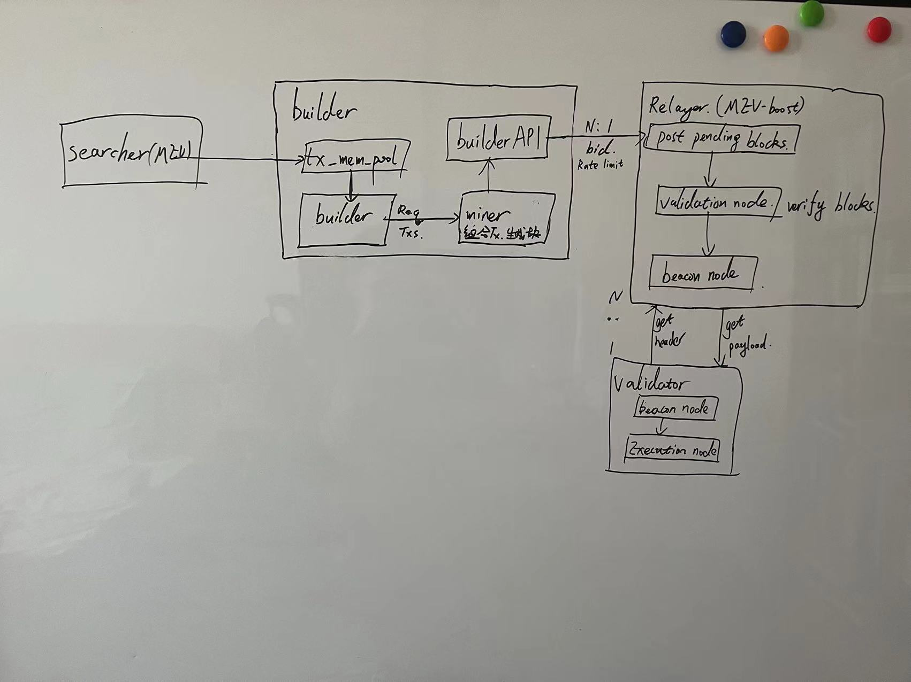

# flashbots builder 学习笔记

根据 [flashbots/builder](https://github.com/flashbots/builder) 仓库展开学习

## 背景

### MEV - Maximal Extractable Value

用户交易提交成功后，进入 mempool，mempool 是由像你我这样的普通用户提交的待处理交易的数据库，MEV 游戏就是从这里开始的。

一旦交易进入内存池，搜索者就会开始扫描黑暗森林以寻找有利可图的 MEV 机会。搜索者通常是运行套利机器人的大型机构和自营交易平台，但有时也包括个人。他们支付高昂的 Gas 费来让验证者接受他们的交易订单，而不是通过公共池。

虽然搜索者本身并不是中心化风险，但他们通过与区块构造者勾结，在实现巨大的中心化部分发挥了作用。它们在协议层中的作用是打包交易并将它们传递给黑暗森林下一个梯级的区块构造者。搜索者和矿工开始在地下市场勾结，以最有效地选择交易以最大化他们自己的 MEV 利润。

### PBS - Proposer Builder Separation

提议者和构建者分离策略



**searcher:** 发送用户的交易到公共内存池

**block builder:** 从公共内存池按照自己对交易顺序的排量组合，构建一组符合自己策略的 tx bundle

**mempool:** 待处理的用户的交易

**builder:** 把交易事件整理出一个 MEV 的 bundle，并发送给 miner。每当有 tx event 时触发 building job

**miner:** 接受到 builder 的参数和 bundle 后，创建一个 block，并出价给 relayer 中继

**relayer:** 作为被 buider 和 validator 共同信任的节点，从 builder 收集竞价，验证block并隐藏内部交易，通过 getHeader 展示给 validator，当 validator 购买后，通过 getPayload 发送 body

**validator:** 验证完成后，把交易数据提交到 EL

## Local Devnet

参考: https://github.com/avalonche/eth-pos-devnet

### 解决的问题

`create-beacon-chain-genesis` 无法生成 `genesis.ssz` 文件

**出现错误**
msg="Could not generate beacon chain genesis state" error="could not set config params: config name=interop conflicts with existing config named=mainnet: configset cannot add config with conflicting fork version schedule"

通过排查仓库中 DockerFile docker-compose.yml config.yml 文件

- compose 中，`beacon-chain` 服务的 `interop-genesis-state` 参数应为 `genesis-state`。（根据 prysm 文档）
- 创建信标链创世节点的配置缺少 `CAPELLA_FORK` 参数。[shanghai-and-capella-forks](https://beincrypto.com/eth-core-devs-roll-out-shanghai-and-capella-forks/)，核实最后提交时间确定问题

### 尚未完全解决的问题

- flashbots-pos-geth-1: could not fetch validators map, Syncing to latest head, not ready to respond
- flashbots-pos-beacon-chain-1: wanted chain ID 32382, got 1

## Testnet

**参考**

- https://github.com/flashbots/mev-boost/wiki/Testing
- https://docs.prylabs.network/docs/install/install-with-script

#### Step 1 - 安装 prysm，生成 jwt 密钥

因为 http 在信标节点和执行节点的通信需要使用 jwt 加密，使用

```bash
./prysm.sh beacon-chain generate-auth-secret`
```

生成 jwt.hex 文件

#### Step 2 - 使用 geth 运行 execution node - Execution Layer

```bash
geth --goerli --http --http.api eth,net,engine,admin --authrpc.jwtsecret /path/to/jwt.hex
```


#### Step 3 - 使用 prysm 运行 beacon node - Consensus Layer

```bash
# 使用该仓库的 genesis.ssz
git clone https://github.com/eth-clients/eth2-networks

# 运行信标节点，替换 jwt-secret，genesis-state 路径，替换收费地址
./prysm.sh beacon-chain --execution-endpoint=http://localhost:8551 --prater --jwt-secret=path/to/jwt.hex --genesis-state=genesis.ssz --suggested-fee-recipient=0x01234567722E6b0000012BFEBf6177F1D2e9758D9
```


使用 [checking-status](https://docs.prylabs.network/docs/monitoring/checking-status) 查看节点状态

#### Step 4 - 使用 prysm 运行 validator node - Consensus Layer

验证者运行在信标链，需要质押 32ETH 成为验证者。所以需要生成 keys

```bash
# 下载 deposit
wget https://github.com/ethereum/staking-deposit-cli/releases/download/v2.5.0/staking_deposit-cli-d7b5304-darwin-amd64.tar.gz
tar xvf staking_deposit-cli-d7b5304-darwin-amd64.tar.gz

# 生成 validator-keys
./deposit new-mnemonic --num_validators=1 --mnemonic_language=english --chain=prater

# 关联账户和节点
./prysm.sh validator accounts import --keys-dir=<YOUR_FOLDER_PATH> --prater
```

把 `deposit_data-*.json` 上传到 [goerli](https://goerli.launchpad.ethereum.org/en/overview)，并调用 metamask 授权转账。

```
# 运行验证节点
./prysm.sh validator --wallet-dir=<YOUR_FOLDER_PATH> --prater
```


#### Step 5 - mev-boost

```bash
git clone https://github.com/flashbots/mev-boost
cd mev-boost
# 用于中继 relay 服务
make build
# 用于测试
make build-testcli

# 运行
./mev-boost -goerli -relay-check -relays https://0xafa4c6985aa049fb79dd37010438cfebeb0f2bd42b115b89dd678dab0670c1de38da0c4e9138c9290a398ecd9a0b3110@builder-relay-goerli.flashbots.net
```


使用 [test-cli](https://github.com/flashbots/mev-boost/tree/main/cmd/test-cli) 测试

## miner

miner 中支持多个 tx selection 策略，可以根据不同策略组合出一组 txs bundle 以实现最大化利润。

**worker:**

接收到 event 后，自动生成 task，使用选择的策略生成 Work，在 multi_worker 中，对 config 做了一些分支处理，如根据 algo 选择了不同的 worker 类型

**algo:**

`algo_greedy.go:buildBlock` 使用 greedy 策略来生产块，该方法从 worker 中 copy 出 events，然后选择出交易。当有新的交易到达，重复执行以获得最新的 bundle

**miner:** 

miner 的 config，包括 gas，interval，algo 策略，创建 block 及 payload，并调用 `multi_worker:buildPayload`

## TODO

- 使用 docker 运行 local devnet
